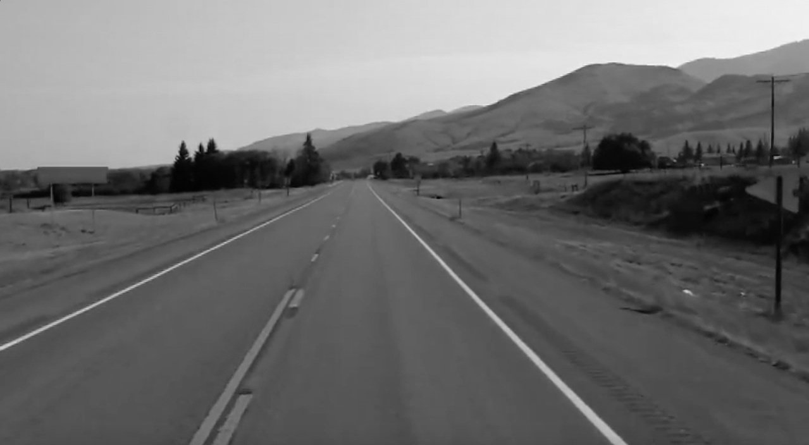
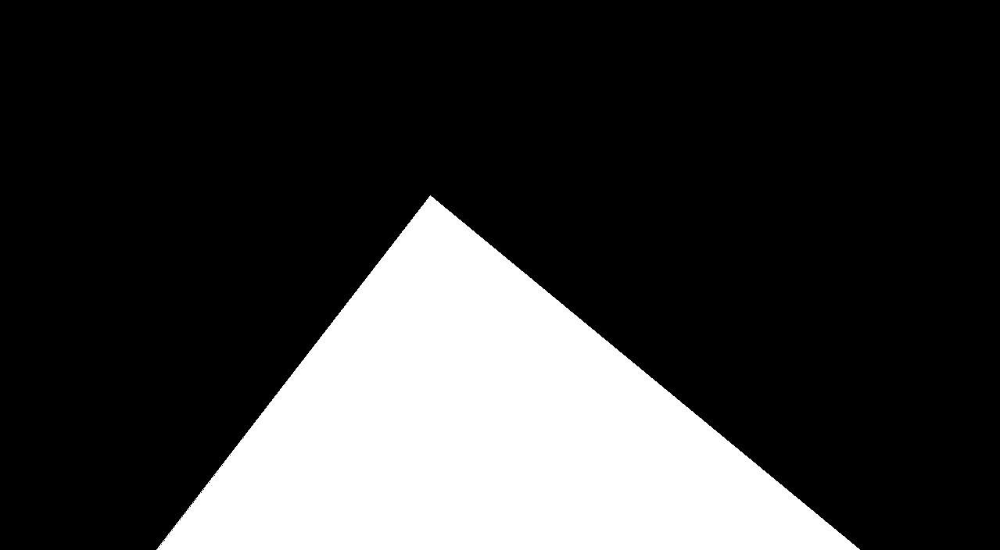

# Repository Overview 
This repository contains Python code for self-driving cars that use computer vision and deep learning techniques to address problems that autonomous vehicles face, such as detecting lane lines and predicting steering angles in real-time.


## Project Setup

### OpenCV Installation


OpenCV stands for “Open Source Computer Vision” is a library for computer vision and machine learning software library. OpenCV has C++, Python, Java and MATLAB interfaces and supports Windows, Linux, Android, and Mac OS. 

```
$ pip install opencv-python
```

## Use OpenCV to Load Image 
The cv2.imread() method loads an image from the specified file. We read the .jpg file as an RGB image. If the image cannot be read (because of missing file, improper permissions, unsupported or invalid format) then this method returns an empty matrix.

```python
image = cv2.imread('/data/Lane_Original.jpg')
```
### Original Image


In a real-life scenario, an autonomous vehicle would process a video instead of an image, but for the sake of learning, we demonstrate how to detect the lanes in a particular image first. 

## Apply Edge Detection Algorithm to Image
The Canny Edge Detector is an edge detection operator that uses a multi-stage algorithm to detect a wide range of edges in images

```python
def detect_edges(image):
    grayscale_image = cv2.cvtColor(image, cv2.COLOR_RGB2GRAY)    
    blurred_image = cv2.GaussianBlur(grayscale_image, (5,5), 0)
    edges = cv2.Canny(blurred_image, 50, 150)  
    return edges   
```

### Convert RGB Image to Grayscale
Before applying the lane detection algorithm to our image, we need to convert the RGB Image to a Grayscale Image because the Canny Detection Algorithm can only be applied on a 2-Dimensional Image. In order to achieve this, use the cvtColor function to convert the image from a color space to another.

```python
grayscale_image = cv2.cvtColor(image, cv2.COLOR_RGB2GRAY)    
```



As first input, this function receives the original image. As second input, it receives the color space conversion code. Since we want to convert our original image from the BGR color space to gray, we use the code COLOR_BGR2GRAY. Essentially, we are reducing the complexity of the image by transforming a 3D Array (RGB Image) into a 2D Array (Grayscale Image). 

### Reduce Image Noise
We apply a Gaussian Blur to the 2-D Grayscale Image using the OpenCV library by calculating the gradient in all directions in the image. The second and third parameter of the GaussianBlur() function represent the kernel size and the number of dimensions.

```python
blurred_image = cv2.GaussianBlur(grayscale_image, (5,5), 0) 
```

### Canny Edge Detection Algorithm
We use the OpenCV Library to implement the Canny Edge Detection Algorithm to the blurred image. The second and third parameters represent the low and high threshold of the image.

```python
edges = cv2.Canny(blurred_image, 50, 150)  
```

## Generate Region of Interest Mask
The following block of code uses NumPy to generate a matrix of 0s and 1s to represent our region of interest, the road in the image. 

```python
height = image.shape[0]
vertices = np.array([(200, height), (1100, height), (550, 250)])
mask = np.zeros_like(image) 
cv2.fillPoly(mask, np.int32([vertices]), 255) 
```


The white and black regions are represented by pixel values of 1 and 0, respectively.


